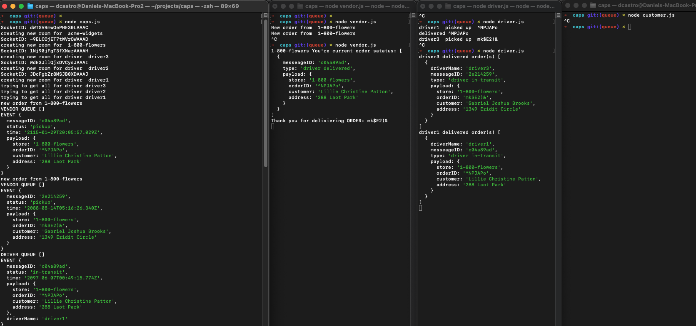
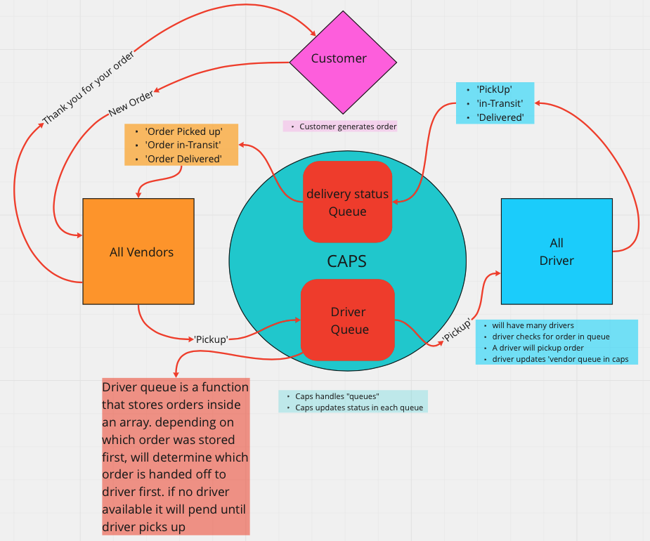

> ## Phase 3 Requirements

In Phase 3, we are building a set of features to help manage deliveries made by `CAPS Drivers`. This will simulate a delivery driver receiving a list of orders from a Queue and **“scanning”** package codes on delivery. Retailers will be able to see in their dashboard or log, a list of all packages delivered in real time. Should a delivery driver deliver many packages while the retailer is not connected to the dashboard, the vendor client should be guaranteed to receive **“delivery”** notifications from the Queue system.


- As a vendor, I want to **“subscribe”** to “delivered” notifications so that I know when my packages are delivered.

- As a vendor, I want to **“catch up”** on any “delivered” notifications that I might have missed so that I can see a complete log.

- As a driver, I want to **“subscribe”** to “pickup” notifications so that I know what packages to deliver.

- As a driver, I want to **“catch up”** on any “pickup” notifications I may have missed so that I can deliver everything.

- As a driver, I want a way to **“scan”** a delivery so that the vendors know when a package has been delivered.

# LAB - 13

## Deployment Test

- Author: Danny Castro
- Collaborator and assistance: Josh McClung, Tony Regalado, Martha Quintanilla-Ramirez, Sarah Teklemariam


### Setup

`.env` requirements

N/A

### Running the app

Must run 4 terminals:

- node caps.js
- node vendor.js
- node driver.js
- node customer.js

> ###Terminal view:



## **VENDOR UPDATE FROM THE `QUEUE` WHEN THEY LOGIN**

```javascript

New order from  1-800-flowers
Thank you for deliviering ORDER: AmYZYwy
New order from  1-800-flowers
^C
➜  caps git:(queue) ✗ node vendor.js
1-800-flowers You're current order satatus: [
  {
    messeageID: '7d794acf',
    type: 'driver delivered',
    payload: {
      store: '1-800-flowers',
      orderID: 'AmYZYwy',
      customer: 'Patrick Christian Swanson',
      address: '985 Fuvis Drive'
    }
  }
]
```
## **DRIVER UPDATE FROM THE `QUEUE` WHEN THEY LOGIN**

```javascript
driver1 delivered order(s) [
  {
    driverName: 'driver1',
    messeageID: '7d794acf',
    type: 'driver in-transit',
    payload: {
      store: '1-800-flowers',
      orderID: 'AmYZYwy',
      customer: 'Patrick Christian Swanson',
      address: '985 Fuvis Drive'
    }
  }
]
driver3 delivered order(s) [
  {
    driverName: 'driver3',
    messeageID: '85047368',
    type: 'driver in-transit',
    payload: {
      store: '1-800-flowers',
      orderID: 'M84%pa&',
      customer: 'Minnie Lucille Reynolds',
      address: '262 Vemom Pass'
    }
  }
]
```

### Tests

>### stop driver.js and vendor.js files and restart to trigger queue info


> ## UML

*(Created with figma)*



